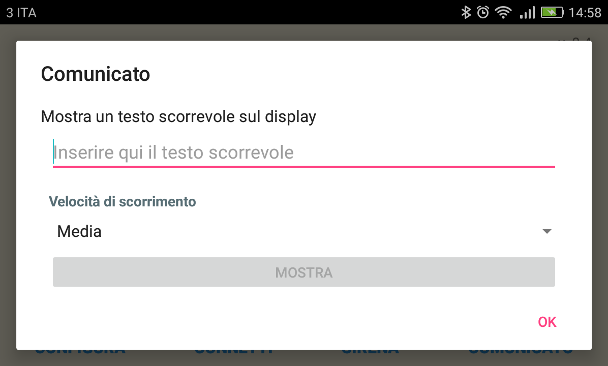

[//]: # (encoding=utf-8)

# SPS HC20 - droid edition v. 0.4

Il programma _SPS HC20_ emula la consolle di controllo del tabellone IBLE SPS HC20.

## Prerequisiti

Affinché il programma possa comunicare con il circuito di controllo del tabellone è necessario che il terminale Android supporti la modalità USB OTG.

## Predisposizione del sistema

Attenersi alla seguente procedura di avvio:

1. accendere il terminale Android;
2. collegare il circuito di controllo alla presa USB del terminale con un cavo USB OTG;
3. il terminale chiederà se avviare l'applicazione _SPS HC20_: confermare;
4. collegare il cavo del tabellone al circuito di controllo.

Per lo spegnimento, eseguire la procedura all'inverso.

## Maschera principale

La parte superiore della maschera contiene il contaminuti che è controllato dai tre pulsanti dall'ovvio significato **AVVIA** (**PAUSA**), **CAMBIA** e **AZZERA**; il pulsante **TIMEOUT** serve per la gestione dei timeout (cfr. sezione «Timeout» più avanti):

La parte centrale della maschera contiene i dati relativi alle due squadre: i controlli degli indicatori dei 7 falli e dei timeout, il numero di set vinti e il punteggio corrente. Gli indicatori si accendono attivando la relativa opzione, i conteggi del set e del punteggio si incrementano e decrementano con gli appositi pulsanti.

La parte inferiore della maschera contiene i pulsanti di controllo del programma: **CONFIGURA** richiama la pagina di configurazione, utile nel caso si voglia modificare il funzionamento del programma "in corsa", mentre **CONNETTI** (**DISCONNETTI**) controlla lo stato del collegamento tra il terminale Android e il circuito di controllo. Il pulsante **SIRENA** aziona la sirena -- il suono viene emesso fintantoché il pulsante è premuto. Il pulsante **COMUNICATO** consente di mostrare una scritta scorrevole al posto del contaminuti.

## Configurazione

I parametri della configurazione sono:

* **Durata di un tempo (in minuti)**: durata di una frazione di gioco, espresso in minuti;

* **Suona la sirena di fine tempo**: emette un suono di sirena al termine di ogni frazione di gioco;

* **Suona la sirena di inizio timeout**: emette un suono di sirena alla chiamata di un timeout;

* **Suona la sirena di imminente fine timeout**: emette un suono di sirena a dieci secondi dal termine del timeout;

* **Mostra lo zero iniziale nei minuti**: aggiunge lo zero delle decine quando il numero di minuti è inferiore a 10. Supponendo di trovarsi al minuto 7 e 42 secondi di gioco, questa opzione consente di visualizzare l'orario **07:42** anziché **7:42**;

* **Mostra i decimi di secondo nell'ultimo minuto**: mostra secondo, centesimo di secondo (arrotondato alla decina precedente) anzichè minuto, secondo nel contaminuti durante l'ultimo minuto di ogni frazione di gioco;

* **Mostra le statistiche di comunicazione**: mostra alcuni contatori relativi alla comunicazione con il circuito di controllo, utile per verificare la qualità della trasmissione.

Se il collegamento con il circuito di controllo è avvenuto con successo, il il pulsante che controlla la connessione recherà la dicitura **DISCONNETTI**; nel caso non sia stato possibile stabilire la comunicazione (es. il terminale non supporta la modalità USB OTG, il circuito non è stato connesso al terminale, il cavo di collegamento utilizzato non è compatibile con la modalità USB OTG, ...) la dicitura sarà **DISCONNETTI**.

## Uso del programma

L'uso del programma è in buona parte intuitivo. Ci sono tuttavia alcuni aspetti sui quali vale la pena spendere due parole.

### Timeout

Il timeout può essere gestito in due modalità: arrestando il contaminuti con il pulsante **PAUSA**, oppure attraverso il pulsante **TIMEOUT**. Nel primo caso il tabellone mostrerà il minuto, secondo di inizio del timeout per tutta la durata dell'interruzione, e il conteggio dovrà essere riavviato premendo il pulsante **AVVIA** alla ripresa del gioco comandata dall'arbitro.

Nel secondo caso, il tempo di gioco mostrato nel contaminuti viene sostituito dal conteggio del minuto di timeout e, se la configurazione lo richiede, viene emesso il suono di sirena di inizio timeout, dopodiché la maschera principale commuta in modalità timeout:

Al raggiungimento del cinquantesimo secondo di timeout, sempre se richiesto dalla configurazione, verrà emesso il suono di sirena di imminente fine del timeout. Esaurito il minuto di timeout, sul contaminuti riapparirà il minuto, secondo di interruzione del gioco. Il conteggio del tempo di gara ricomincierà alla pressione del tasto **RIPRENDI**, **anche se il minuto di timeout non è stato completato.**

Il pulsante **TIMEOUT** è attivo solamente durante il conteggio del tempo.

### Tempo cumulativo

La visualizzazione del tempo cumulativo di gioco sul contaminuti si ottiene semplicemente evitando di azzerare il contaminuti al termine di ogni frazione.

### Tempi supplementari

Il conteggio dei tempi supplementari si ottiene riconfigurando la durata della frazione di gioco a 5 minuti una volta conclusi i primi due tempi regolamentari.

### Comunicato

È possibile far apparire una scritta scorrevole sul contaminuti. Valutare bene questa opportunità: trattandosi di display sette segmenti la rappresentazione di alcuni caratteri (es. K, M, Q, R, U, V) può risultare di difficile interpretazione. Una prova preliminare è d'obbligo.

Premendo il pulsante **Comunicato** appare la maschera omonima:

Impostato il testo del messaggio da visualizzare e la velocità di scorrimento delle lettere sul tabellone (_Bassa_, _Media_ e _Alta_), premere **Mostra** per iniziare. Il comunicato sostituisce il contaminuti fino a che non viene premuto il tasto **Nascondi** e comunque alla chiusura della maschera. La visualizzazione del comunicato non interrompe un eventuale conteggio sottostante. **Attenzione: il testo scorrevole appare solo sul tabellone, non sullo schermo del terminale Android.**
